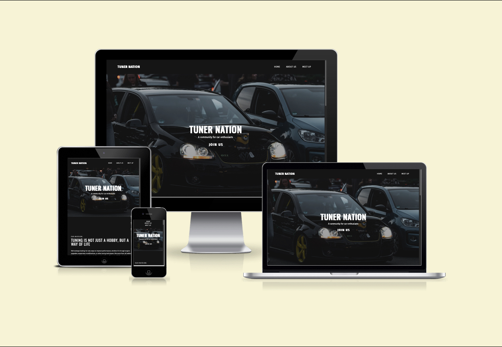

# Tuner Nation

Tuner Nation is a website that celebrates the art of tuning and all things automotive. The website will help car enthusiasts to connect, showcase their cars and learn from one another.

[View live site](https://sorinpan.github.io/tuner-nation/)

## User Experience

### Website Owner Goals

- To increase the number of people attending events.
- To provide clear information about events and how to join.
- To provide clear background and mission information.

### User Stories

#### User Goals

- As a user, I want to see upcoming events so that I can plan to attend and showcase my car.
- As a user, I want to see photos from previous events so that I can so that I can get a sense of what to expect.
- As a user, I want to be able to view the information on a range of screen sizes.
- As a user, I want to easily navigate the website.

#### Returning Customer Goals

- As a returning customer, I want to find new information about upcoming events.
- As a returning customer, I want easily find contact information.

## Design

### Colour Scheme

The colours where choosen to reflect a modern feeling. The combination of Night and Gold gives the website modern look and it is easy on the eye. The colour palette was created with [Coolors](https://coolors.co/).  

### Typography

Google Fonts and FontJoy were used for the following:

- Fira Sans Condensed is used for logo and shorter text.
- Oswald is used for headings.
- Robot is used for the body text of the website.

I think this pairing provides a balanced and visually pleasing contrast.

## Technologies Used

### Languages Used

- HTML5
- CSS3

### Programs Used

- Figma: Used for creating wireframes.
- Visual Studio Code: Used for writing and developing code.
- CodeAnywhere: Used for writing and developing code.
- Git: Used for version control.
- GitHub: Used to store the files and deploy.
- FireFox Developer Edition: Used to test new features before implementing into actual code.
- Google Fonts: Used to import the fonts.
- FontJoy: Used to find fonts pairing.
- Font Awesome: Used for icons.

## Doployment and Development

### Deployed with GitHub Pages

GitHub Pages was used for deployment:

1. Log in to GitHub.
2. Select repository for the project.
3. Go to "Settings".
4. Click on "Pages".
5. In the Source section, select branch "Main" and then select "Root" from the dropdown menu.
6. Click "Save".
7. Wait a couple of section and GitHub will provide the link to deployed website.